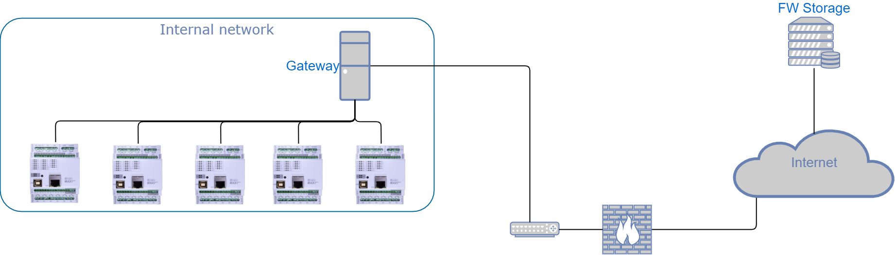

## :exclamation: NEW Board Support Package (BSP) VERSION 3.1.0 AVAILABLE :exclamation:

### If you want to upgrade your CONTROLLINO BSP go to your Arduino IDE Boards Manager!

We have prepared a new version of BSP featuring following changes and upgrades:
* New version of CONTROLLINO MINI bootloader
* Added information for Arduino IDE to be able to burn the bootloader directly from IDE using Arduino UNO

:exclamation: NEW! :exclamation:
Please see our [tutorial how to burn the MINI bootloader with Arduino UNO](https://community.controllino.com/forums/discussion/burn-mini-bootloader-by-arduino-uno-as-isp/) .


If you will face some compilation errors after the update, please check your 
c:\Users\UserName\AppData\Local\Arduino15\packages\CONTROLLINO_Boards\hardware\avr\
folder and remove all previous obsolete versions (e.g. 2.0.0, 2.0.1, 3.0.0, 3.0.1, etc.).

# CONTROLLINO

### FIRST SOFTWARE OPEN-SOURCE PLC (ARDUINO compatible)
https://controllino.com/

This GitHub repository contains all you need to start with CONTROLLINO devices programming in Arduino IDE.
* Arduino IDE extension package for Boards Manager
  * See our [Installation guide](#installation-guide)
* CONTROLLINO library for Library Manager
  * See our [Installation guide](#installation-guide)
  * See our [Reference manual](#reference-manual)
* Examples how to use special features of the CONTROLLINOs
  * When the library is installed in the Arduino IDE, you can find them i the File->Examples menu
* Customized bootloaders for all CONTROLLINO variants
  * See [Bootloaders](/Bootloaders) folder and follow the provided guides
* Frequently Asked Questions
  * See our [FAQ](#faq)

Please note that CONTROLLINO exists in [4 different variants](#controllino-mini).

### CONTROLLINO MINI
* Microcontroller: ATmega328
* Atmel Clock Speed: 16 MHz
* RTC
* 1x serial Interface
* 1x SPI Interface
* 1x I2C Interface
* Input current Max. 8A
* 6x Relays Outputs – 230V / 6A
* 8x Analog/Digital Inputs
* 8x Digital Outputs – 2A @12V or 24V

### CONTROLLINO MAXI
* Microcontroller: ATmega2560
* Clock Speed: 16 MHz
* RTC
* Ethernet Connector
* 2x serial Interface
* 1x RS485 Interface
* 1x I2C Interface
* 1x SPI Interface
* Input current Max. 20A
* 10x Relays Outputs – 230V / 6A
* 12x Analog/Digital Inputs
* 12x Digital Outputs – 2A @12V or 24V

### CONTROLLINO MAXI Automation
* Microcontroller: ATmega2560
* Clock Speed: 16 MHz
* RTC
* Ethernet Connector
* 2x serial Interface
* 1x I2C Interface
* 1x SPI Interface
* Input current Max. 20A
* Input voltage 24V
* 10x Relays Outputs – 230V / 6A
* 12x Analog Inputs
* 6x Digital Inputs (2x Interrupt)
* 8x Digital Outputs – 2A @ 24V
* 2x 0-10V Inputs
* 2x 0-10V/0-20mA Outputs

### CONTROLLINO MEGA
* Microcontroller: ATmega2560
* Clock Speed: 16 MHz
* RTC
* Ethernet Connector
* 2x serial Interface
* 1x RS485 Interface
* 1x I2C Interface
* 1x SPI Interface
* Input current Max. 30A
* 16x Relays Outputs – 230V / 6A
* 21x Analog/Digital Inputs
* 12x Digital Outputs – High Side Switch – 2A @12V or 24V
* 12x Digital Outputs – Half-Bridge - 2A @12V or 24V

## Reference manual

Please, make sure that you have included the CONTROLLINO library in your sketch.
So, you can see `#include <Controllino.h>` at the top of your sketch.

### Aliases for the pins
Of course, you can use Arduino native aliases for the pin numbers like A0, or 2, but CONTROLLINO library provides you its own set of aliases.
It is always combination of CONTROLLINO_ and the text description of the screw terminal you can see on the device. 

For example, for MINI we have defined following aliases:

` CONTROLLINO_D0`

` CONTROLLINO_D1`

` CONTROLLINO_D2`

` CONTROLLINO_D3`

` CONTROLLINO_D4`

` CONTROLLINO_D5`

` CONTROLLINO_D6`

` CONTROLLINO_D7`
 
` CONTROLLINO_A0`

` CONTROLLINO_A1`

` CONTROLLINO_A2`

` CONTROLLINO_A3`

` CONTROLLINO_A4`

` CONTROLLINO_A5` 

` CONTROLLINO_IN0`

` CONTROLLINO_IN1`


### RTC functions
Please, make sure that you have included also the SPI library in your sketch.
So, you can see `#include <SPI.h>` at the top of your sketch. 
It should be added automatically with the `#include <Controllino.h>`.

**Do not forget to properly setup the mechanical switch at your MINI!**

##### Initializes RTC library, SPI bus and RTC chip (RV-2123)
 *  @return Always returns 0
 
`char Controllino_RTC_init()`

##### Sets time and date to the RTC chip (RV-2123)
 *  See [RTC chip manual](https://www.microcrystal.com/fileadmin/Media/Products/RTC/Datasheet/RV-2123-C2.pdf) for more information.
 *  @param aDay day 01 - 31
 *  @param aWeekDay weekday 00 - 06
 *  @param aMonth month 01 - 12
 *  @param aYear year 00 - 99
 *  @param aHour hours 01 - 12, or 00 - 23 (depending of 12H/24H mode)
 *  @param aMinute minutes 00 - 59
 *  @param aSecond seconds 00 - 59
 *  @return Returns 0 when succeeded, or -1 if the RTC library was not initialized before
 
`char Controllino_SetTimeDate(unsigned char aDay, unsigned char aWeekDay,unsigned char aMonth, unsigned char aYear, unsigned char aHour, unsigned char aMinute, unsigned char aSecond);`

##### Reads out the time and date from the RTC chip (RV-2123)
 *  See [RTC chip manual](https://www.microcrystal.com/fileadmin/Media/Products/RTC/Datasheet/RV-2123-C2.pdf) for more information.
 *  @param aDay pointer to day 01 - 31
 *  @param aWeekDay pointer to weekday 00 - 06
 *  @param aMonth pointer to month 01 - 12
 *  @param aYear pointer to year 00 - 99
 *  @param aHour pointer to hours 01 - 12, or 00 - 23 (depending of 12H/24H mode)
 *  @param aMinute pointer to minutes 00 - 59
 *  @param aSecond pointer to seconds 00 - 59
 *  @return Returns 0 when succeeded, or -1 if the RTC library was not initialized before
 
`char Controllino_ReadTimeDate(unsigned char *aDay, unsigned char *aWeekDay, unsigned char *aMonth, unsigned char *aYear, unsigned char *aHour, unsigned char *aMinute, unsigned char *aSecond)`

##### Reads out the day value from the RTC chip (RV-2123)
 *  @return Returns day 01 - 31, or -1 if the RTC library was not initialized before
 
`char Controllino_GetDay( void )`

##### Reads out the weekday value from the RTC chip (RV-2123)
 *  @return Returns weekday 00 - 06, or -1 if the RTC library was not initialized before
 
`char Controllino_GetWeekDay( void )`

#####  Reads out the month value from the RTC chip (RV-2123)
 *  @return Returns month 01 - 12, or -1 if the RTC library was not initialized before
 
`char Controllino_GetMonth( void )`

##### Reads out the year value from the RTC chip (RV-2123)
 *  @return Returns year 00 - 99, or -1 if the RTC library was not initialized before
 
`char Controllino_GetYear( void )`

##### Reads out the hours value from the RTC chip (RV-2123)
 *  @return Returns hours 01 - 12, or 00 - 23 (depending of 12H/24H mode), or -1 if the RTC library was not initialized before
 
`char Controllino_GetHour( void )`

##### Reads out the minutes value from the RTC chip (RV-2123)
 *  @return Returns minutes 00 - 59, or -1 if the RTC library was not initialized before
 
`char Controllino_GetMinute( void )`

##### Reads out the seconds value from the RTC chip (RV-2123)
 *  @return Returns seconds 00 - 59, or -1 if the RTC library was not initialized before
 
`char Controllino_GetSecond( void )`

##### Reads time and date from RTC chip and prints it on serial line
 *  This function expects that the Serial was initialized before calling it.
 *  Format is DD/MM/YY   HH:MM:SS
 *  @return Returns seconds 0, or -1 if the RTC library was not initialized before
 
`char Controllino_PrintTimeAndDate( void )`

##### Sets the alarm function on the RTC chip
*  @return Returns 0 when succeeded, or -1 if the RTC library was not initialized before
`Controllino_SetAlarm(unsigned char aHour, unsigned char aMinute)`

##### Clears the alarm function on the RTC chip
*  @return Returns 0 when succeeded, or -1 if the RTC library was not initialized before
`Controllino_ClearAlarm( void )`


### RS485 functions

Please note that RS485 interface is present only in MAXI and MEGA variants.

##### Initialization of the RS485 bus
 *  @param Baudrate
 *  @return Always returns 0
 
`char Controllino_RS485Init( Baudrate )`

##### Control of RS485 direction to receive 
* Do not forget to wait until all data were transmitted before you switch back to reception
* You can use Serial3.flush() function for that.

`Controllino_RS485RxEnable()`

##### Control of RS485 direction to transmit 
* Do not forget to wait until all data were transmitted before you switch back to reception
* You can use Serial3.flush() function for that.

`Controllino_RS485TxEnable()`

## Installation guide

1. General requirements
 * PC with Arduino IDE (1.6.4 or newer) (Windows, Linux, MAC)
 * Internet connection

2. CONTROLLINO library
 * Start Arduino IDE, navigate to Sketch–>Include Library–>Manage Libraries
 * In the Library Manager type CONTROLLINO into the filter text box and search for CONTROLLINO library
 * When found, select the latest version and install it. The installation process should be fully automated
 * When finished - check in Sketch–>Include Library menu that you can see the CONTROLLINO library there
 * You can also check if you can see the set of CONTROLLINO examples in File->Examples->CONTROLLINO

3. CONTROLLINO boards hardware definition
 * Navigate to File–>Preferences 
 * Copy-paste the following link to the Additional Boards Manager URLs: 
https://raw.githubusercontent.com/CONTROLLINO-PLC/CONTROLLINO_Library/master/Boards/package_ControllinoHardware_index.json
 * Press OK button
 * Then navigate to Tools–>Board: “Foo“–>Boards Manager
 * In the Boards Manager type CONTROLLINO into the filter text box and search for CONTROLLINO boards 
 * When found, select the latest version and install it. The installation process should be fully automated
 * When finished - check in Tools–>Board: “Foo“–> menu that you can see the CONTROLLINO boards there
 
 
## FAQ

**1. Automated installation through Arduino Board Manager gets 403 Forbidden in Arduino IDE for OSX**

*Answer: This issue was reported for Arduino IDE 1.6.11. In older versions - e.g. 1.6.8 it worked fine. With the latest Arduino IDE version (1.8.1) it also works fine.* 

**2. AnalogRead always returns 806 instead of 1023**

Question: A0 should read 0 and 1023 (its connected to D0 pin), but instead it reads 0 and 806. Is there anything wrong with the voltage reference or am I missing something? Btw, power supply is 24 volts.

*Answer: This is caused by the fact that CONTROLLINO actually doesn't have maximum of 24V. The maximum for 24V setting is close to 30V. So, value 1023 will be returned when you would get close to 30V power supply. See our example AnalogInputs.*

**3. Digital 20 - Digital 23 mapping**

Question: Pins Digital 20 - Digital 23 seem not to be implemented to use with digitalWrite, from Arduino lib. Is it possible to use those pins with your library? I understand, that these pins don't have an according alias on arduino, but still. I would really like to somehow circumvent using this syntax in order to set Digital 20.
`PORTD = B11110111`

*Answer: It is correct. Our library does not support these digital outputs as we have tried to do not touch Arduino Core functionality. But it may be a point for further releases...
I am afraid that you have to use this "PORTD" way to control these pins. Please check example sketch PortManipulation in the Arduino IDE for more details.*

*UPDATE - should be fixed with BSP version 3.0.0. - all CONTROLLINO pins have Arduino number now!*

**4. CONTROLLINO boards not showing with arduino IDE 1.6.12**

Question: Loading the Controllino Library into the Arduino 1.6.12 IDE does not show up the Controllino boards on the board types list.

*Answer: You also need to install the "CONTROLLINO Hardware" by the Boards Manager.*

**5. How to burn bootloader**

Question: Is it possible to burn bootloader in Controllino? I want to add possibility for OTA updates by Ethernet.

*Answer: Yes, it is possible. We are fully compatible with Arduino! All ICSP signals are available at the X1 pinheader connector of your CONTROLLINO. See https://www.controllino.com/downloads/#datasheets for more details. You just need ICSP programmer and six wires to handle that.*

**6. Unable to locate (obsolete) hardware description files on GitHub**

Question: My Arduino IDE gives me following error message: "Error downloading ....githubusercontent.com/Controllino/ControllinoHardware/master/package_ControllinoHardware_index.json". Is it unable to locate hardware description files?

*Answer: Our GitHub repository has been moved to a new location, therefore this path is no longer valid. Please, follow our new [Installation guide](#installation-guide).*

**7. Pin header SPI bus communication is not working properly (MAXI, MEGA)**

Question: I am not using RTC and/or Ethernet built in CONTROLLINO MAXI/MEGA. I am trying to use SPI bus available at pinheader, but it sometimes work and sometimes not. Is there any conflict with RTC chip and Etherent chip connected to the same SPI bus, even if I am not using them?

*Answer: When SS pins PJ2 (RTC) and PJ3 (Wiznet) are not properly handled, it may happen that the floating pin is recognized as a valid chip select signal and the RTC chip or Wiznet chip is accidentally connected to SPI bus - MISO signal.*
 
*Call this function prior to usage of the SPI bus:*

`Controllino_RTC_init();`
 
**8. CONTROLLINO MINI A6, A7 inputs**

Question: It is not possible to read digital value of the A6 and A7 inputs on CONTROLLINO MINI.

*Answer: These pins are analogue inputs only and it is not possible to read their digital status, because of the microprocessor architecture. The only chance is to read out their analogue value and distinguish by some threshold value.*

**9. CONTROLLINO MAXI Ethernet.localIP() always returns 255.255.255.255**

Issue: I bought a Controllino MAXI and I had difficulties connecting through Ethernet. Ethernet.localIP() always returned 255.255.255.255.

*Solution: The problem was due to the fact that Arduino IDE linked the standard Ethernet library and not Controllino's one (it appeared in the compilation logs of Arduino IDE). Under ArchLinux, I manually replaced /Arduino/libraries/Ethernet by Controllino's Ethernet folder (/.arduino15/packages/CONTROLLINO_Boards/hardware/avr/2.0.1/libraries/Ethernet/src) and it worked.*

*UPDATE - should be fixed with BSP version 3.0.0. - CONTROLLINO uses standard Arduino Ethernet library now!*

**10. There is not possible to upload a new sketch to CONTROLLINO anymore**

Issue: The CONTROLLINO works fine, but after some time (and successfully uploaded sketches), it seems to be bricked. It is not possible to upload any sketch and Arduino IDE reports some kind of avrdude: verification error, or avrdude: stk500_recv(): programmer is not responding. 

*Solution: The problem is not related to CONTROLLINO platform only. It seems to be a general weakness of Arduino IDE, avrdude and original bootloader. It is still not clear what exactly happens, but it seems that after upload of a corrupted binary the microcontroller skips the bootloader when reset during operation.*

Please, try following steps: 
 - Disconnect the power and USB cable
 - Press and hold Reset button at CONTROLLINO
 - Connect USB cable
 - Press Upload button in Arduino IDE
 - Release Reset button when “Compiling sketch ...” message changes to “Uploading”
 
**11. Ethernet issues with PlatformIO**

Issue: Right now ethernet works for me out of the box in Arduino IDE, but I'd like to use PlatformIO and the compilation fails - the compiler does not see Ethernet.h file. 

*Solution: Tell the PlatformIO all dependencies to the external libraries used by your project.*

Try following steps: 
 - Make sure that you have the latest version of the PlatformIO -  run `$ pio update`
 - Create a new project for one of the CONTROLLINO boards
 - Edit file `platformio.ini` 
 - extend the line lib_deps in this way `lib_deps = Ethernet@^2.0.0, SPI`
 
 Then Ethernet examples should work!
 
 See docs https://docs.platformio.org/en/latest/librarymanager/quickstart.html#project-dependencies for more details!


**12. Internal pull-up for input pins does not work**

Issue: The following line of code fails to raise the voltage level of the pin to high:
```c
pinMode(pin, INPUT_PULLUP);
```

*Solution: Attach sufficiently small external pull-up resistors to all inputs requiring pull-up mode.*

Suggested pull-up resistors:
* screw terminals: 8kΩ
* pin header: 1.5kΩ

Explanation: CONTROLLINO boards contain additional pull-down resistors:
* screw terminals: 80kΩ
* pin header: 15kΩ

See [issue #26](https://github.com/CONTROLLINO-PLC/CONTROLLINO_Library/issues/26#issuecomment-474915625) for details.

**13. Is it possible to upload a new sketch to CONTROLLINO OTA (Over The Air) so via Ethernet**

Issue: It is needed to upload the new sketch to CONTROLLINO over the network (Ethernet)

*Solution: There are two mainstream solutions for the Arduino OTA remote update*

**_Data transfer is done in sketch context_**

There is a library that supports ArduinoIDE and is in Library Manager.
 See: https://github.com/jandrassy/ArduinoOTA. There are some requirements, which has to be met for seamless use of this library:
* User sketch includes a library and accommodates code that broadcasts "Here I am, ready for OTA" and listens on a port for incoming binary
* UDP broadcast has to be enabled for ArduinoIDE to receive this message
* When the new binary is coming (from Arduino IDE in the local network) it is stored in an unused part of the program flash memory (“second partition”), so the memory has to be at least 64 kB.
* A modified OptiBoot bootloader is needed to flash binary file from this "second partition".

**_Data transfer is done in bootloader context_**

There are several libraries for Arduino boards that implement a TFTP server. 

See: 
https://github.com/per1234/Ariadne-Bootloader

https://github.com/loathingKernel/ariadne-bootloader

https://github.com/codebndr/Ariadne-Bootloader

Also for all these libraries, there are some requirements, which has to be met for seamless use: 
* User sketch or the device itself has to be commanded to reset into bootloader
* The bootloader starts the TFTP server, so TFTP protocol has to be enabled on the network
* Sketch has to be in binary format

Both of these solutions depend on communication via Local Area Network so, if an update over the internet is needed, there has to be some kind of Gateway, which will do the update itself.
See:


There is also another option. Use solution 1, but implement a periodical check of some HTTP server (Please note, that CONTROLLINO hardware is not capable of SSL/TLS encryption, so no HTTPS is possible).	In a case of a new FW available it downloads it to the second partition and resets the device. Then the modified OptiBoot bootloader is needed to flash binary file from second partition.


:exclamation:Special bootloaders mentioned above do NOT work with CONTROLLINO HW out of the box. 

**14. Support in Arduino IDE 2.0, Arduino CLI and IDE running on MAC OS 10.15 and newer**

Issue: Compilation error in some environments.

*Solution: Use of appropriate versions of gcc tools.*

Since 28 June 2021, the tools dependencies in the HW package definition has been changed. 
The new installation of the Board support package should be working even on Arduino IDE 2.0, Arduino CLI and IDE under MAC OS.
If you still encounter a "Compilation Error" please try to reinstall Board support package.